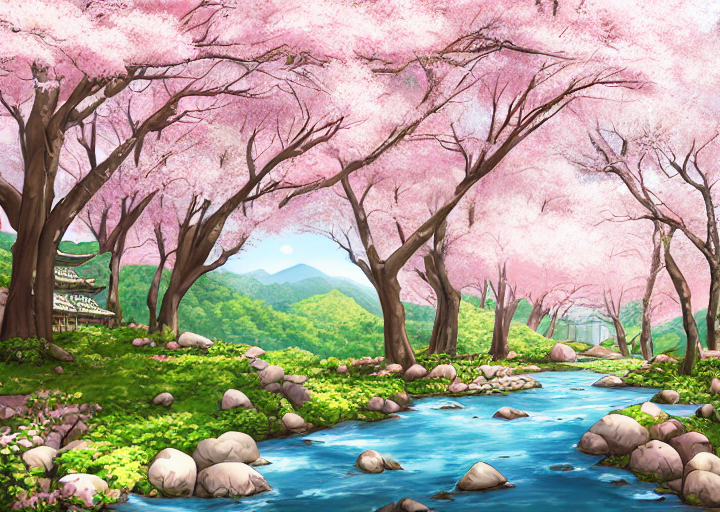

# Cheseia-Legend-of-Aureliae

webhook test

## todo:
- move materials in weapon_gen to materials and sort them by material type for general use
    - raw
        - natural
        - ore
    - refined
        - metal
        - natural
    - alloys
- make armor_gen
- make jewerly_gen
- refactor all enemies into separate groups
    - add function so that depending on player location specific enemies appear in random encounters
    - scripted encounters
    - have enemies scale so that the weaker enemies forced encounters with the weaker enemies still offer decent rewards (make the interaction worth something)
- make combat work/rebuild it
    - redo player all of the player's actions
    - make player armor/clothing do something (flat and or percent damage reduction)(passive effects)
    - make player jewelry do something (passive effects)
    - pack enemies
    - make enemy AI
        - make humanoid enemies use consumables (if they have them)
        - have some strong enemies with stronger physical dmg than magical prowess that can buff themselves with the magical knowledge they do have (and maybe something alike for strong magic users with decent physical dmg)
- bosses (maybe do one or two as a baseline)
    - individual boss mechanics & ai
    - boss loot
- the various world location types and their functions
    - Towns and cities are enterable
    - dungeons are enterable
    - ruins are enterable
    - dens are enterable
    - caves are enterable
- the various city location types and their functions(priority top down bottom being least important to game function)
    - library (Enchanting gear(Weapons, Armor, Jewerly), Enhancing Jewerly, lore?)
    - smithy (Enhancing Weapons, Crafting weapons)
    - armory (Buying armor, Enhancing Armor)
    - gemstore (Buying gems for Enchanting/Crafting)
    - tavern/inn (replenishing consumables, replenishing health/stamina/mana)
    - restaurant (buying extra consumables, temporary buffs from food? lore?)
    - town hall (gathering area for NPC, taking on tasks from NPC, quests from NPC, lore?)
        - allow the generated NPC to randomly interact with the player
    - guild hall (taking on guild tasks/quests, tasks being repeatable means of making coin)
    - castle for speaking with Aureliae herself (quests, lore, yuri :3)
    - dock traveling to & from locations along rivers/coastlines
--- Lowest Priority ---
    - city hall (similar to town halls)
    - jail (exsists for questing purposes(maybe other stuff idk :shrug:))
    - castle dungeon (same as above)
    - estates/NPC houses (same as jail)
    - player housing

## completed: 
